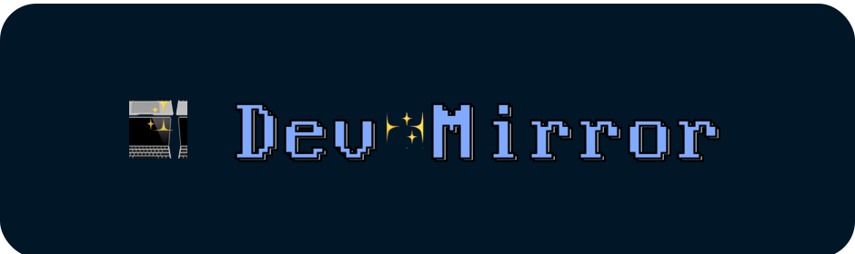

# Dev Mirror for Terminal.app

The optimized dark theme for development.

## Installation

- Run `curl -O https://raw.githubusercontent.com/elyps/dev-mirror/master/Terminal.app/dev-mirror.terminal` or save the file manually
- Open `./dev-mirror.terminal`
- Open terminal preferences (<kbd>cmd</kbd> + <kbd>,</kbd>)
- Go to Profiles and select `dev-mirror`

## Author

- [Bastian Fischer](https://www.bastian-fischer.dev)

## License

This project is open source and available under the [MIT License](../LICENSE).
