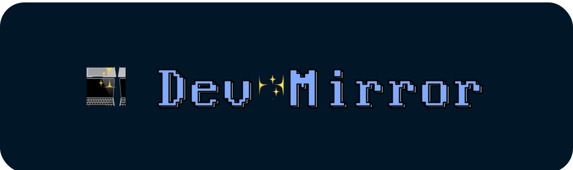
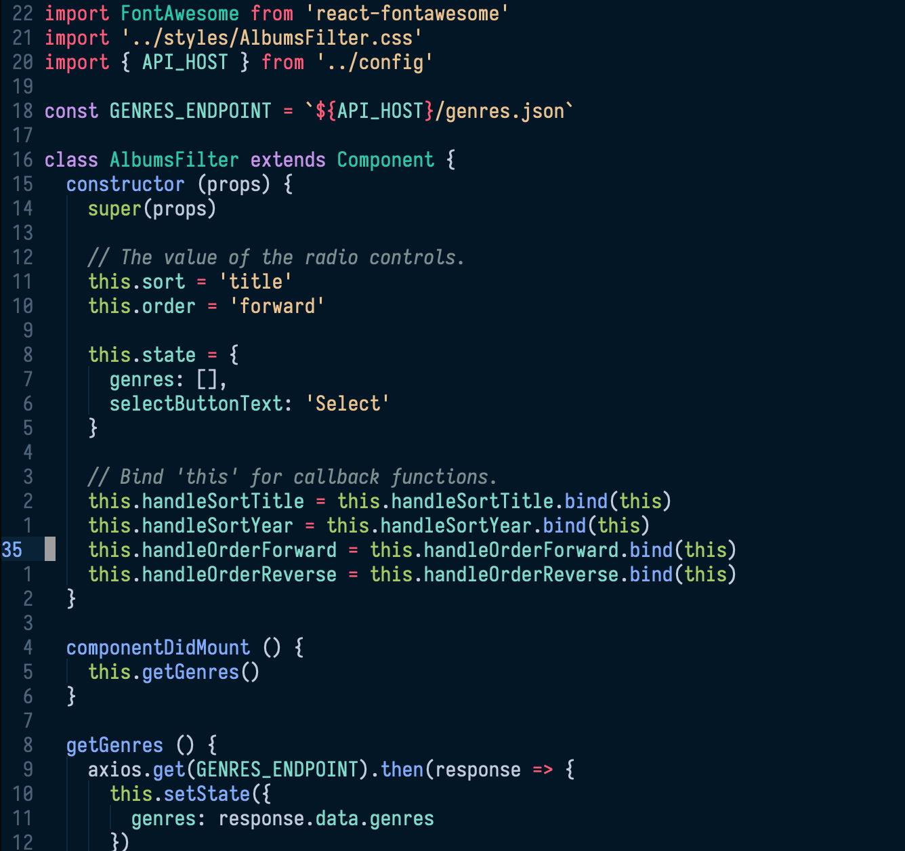

# Dev Mirror for [Example App](https://example.com)

The optimized dark theme for development.

Language
--------

Installation
------------

- Instructions to install

Author
------

- [Author name](https://www.example.com)

License
----------

This project is open source and available under the

