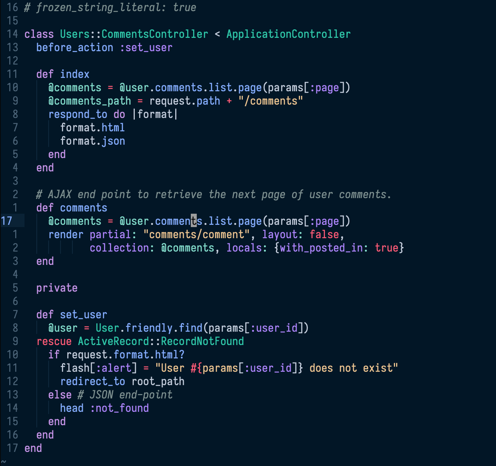
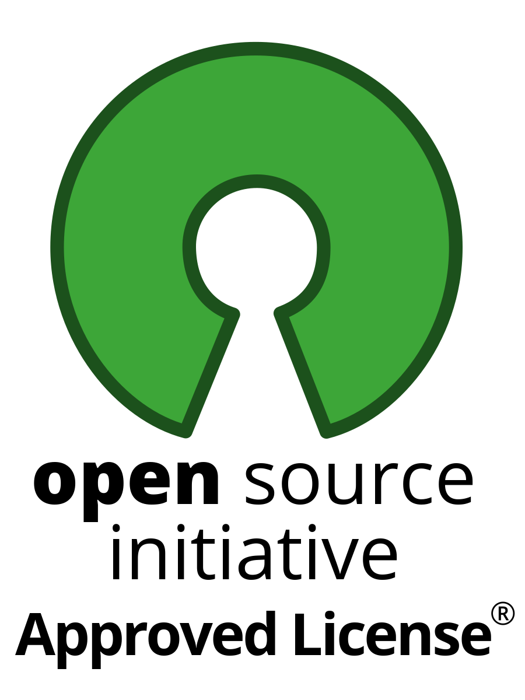

# Dev Mirror Theme

   

[Dev Mirror](https://elyps.github.io/dev-mirror/) is the optimized dark theme for development. It's intuitive, easy on the eyes, and consistent across your entire development environment. It's pleasant for long coding hours in any language, and particularly well suited for HTML, CSS/SCSS/LESS, Ruby, PHP, Python and JavaScript.

- Intuitive connections between HTML and CSS
- Clear distinctions between code and markup
- Optimized for HTML, CSS/SCSS/LESS, PHP, JavaScript, Python and Ruby

Platforms
---------

Dev Mirror is available for:

- [Visual Studio Code](https://marketplace.visualstudio.com/items?itemName=bastian-fischer.dev-mirror-vscode)
- [Chrome DevTools](https://chrome.google.com/webstore/detail/devtools-theme-dev-mirror/lndddploiofhfpdcoclegenegblkhlfk?hl=en)
- [Brackets](https://github.com/elyps/dev-mirror-brackets)
- [Sublime Text](https://packagecontrol.io/packages/Dev%20Mirror%20Color%20Scheme)
- [Atom](https://github.atom.io/packages/dev-mirror-atom-syntax)
- [iTerm2](https://github.com/elyps/dev-mirror/tree/master/iterm2)
- [Terminal.app](https://github.com/elyps/dev-mirror/tree/master/Terminal.app)
- [Blink Shell](https://github.com/elyps/dev-mirror/tree/master/blink-shell)
- [Vim](https://github.com/elyps/dev-mirror.vim)
- [Alfred](https://www.alfredapp.com/extras/theme/3iInBeai82/)

Colors
------
### For other terminals please configure appropriately with the following colors:

| Type           | Category        | Value     | Color                                                       |
|----------------|-----------------|-----------|-------------------------------------------------------------|
| Background     | Background      | `#011627` |  |
| Foreground     | Foreground      | `#acb4c2` |  |
| Bold           | Bold            | `#eeeeee` |  |
| Cursor         | Cursor          | `#9ca1aa` |  |
| Cursor Text    | Cursor Text     | `#080808` |  |
| Selection      | Selection       | `#b2ceee` |  |
| Selection Text | Selection Text  | `#080808` |  |
| Color 1        | Black (normal)  | `#1d3b53` |  |
| Color 2        | Red (normal)    | `#fc514e` |  |
| Color 3        | Green (normal)  | `#a1cd5e` |  |
| Color 4        | Yellow (normal) | `#e3d18a` |  |
| Color 5        | Blue (normal)   | `#82aaff` |  |
| Color 6        | Purple (normal) | `#c792ea` |  |
| Color 7        | Cyan (normal)   | `#7fdbca` |  |
| Color 8        | White (normal)  | `#a1aab8` |  |
| Color 9        | Black (bright)  | `#7c8f8f` |  |
| Color 10       | Red (bright)    | `#ff5874` |  |
| Color 11       | Green (bright)  | `#21c7a8` |  |
| Color 12       | Yellow (bright) | `#ecc48d` |  |
| Color 13       | Blue (bright)   | `#82aaff` |  |
| Color 14       | Purple (bright) | `#ae81ff` |  |
| Color 15       | Cyan (bright)   | `#7fdbca` |  |
| Color 16       | White (bright)  | `#d6deeb` |  |

Samples / Screenshots
-----------

### Ruby

### Javascript

Contributing
------------

Dev Mirror themes for any app are welcome! To contribute:

- Create a repo called `dev-mirror-app-name` based on [template-example](/template-example)
- Add the code for your theme and update the README with a screenshot and installation instructions
- Create an issue requesting to be added to the repository and link to your repo

A git subtree will be added pulling your repo into the main `dev-mirror-theme` repo.

If your theme does not require you to maintain its own repository, simply create a pull request with the theme in a folder.

Acknowledgements
----------------

- Originally inspired by Nightfly
- Chrome DevTools theme forked from [Zero Base Themes](https://github.com/mauricecruz/zero-base-themes).

Author
------

- [Bastian Fischer](https://www.bastian-fischer.dev/)

Sponsor
-------

License
----------
This project is open source and available under the

